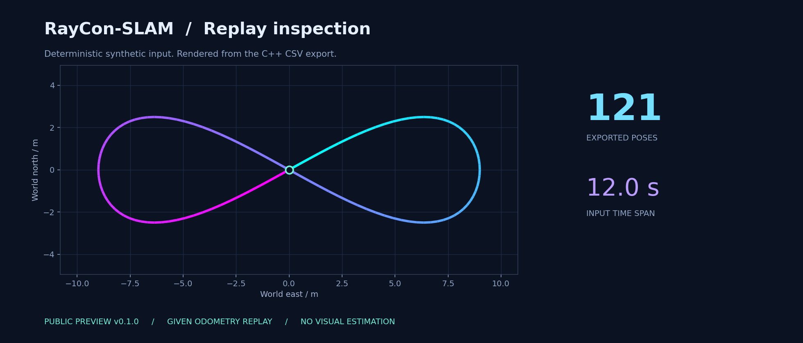

<p align="center">
  
</p>

<p align="center">
  <a href="https://github.com/Midoor98/RayCon-SLAM/releases/tag/v0.1.0"></a>
  
  
  
</p>

<h1 align="center">RayCon-SLAM</h1>
<p align="center"><strong>Visual-Inertial SLAM</strong><br />视觉惯性同步定位与建图（VI-SLAM）</p>
<p align="center"><a href="#quick-start">Quick start</a> · <a href="#preview">Preview</a> · <a href="#roadmap">Roadmap</a> · <a href="docs/INPUTS.md">Input formats</a> · <a href="CHANGELOG.md">Changelog</a></p>

RayCon-SLAM 是一个视觉惯性同步定位与建图（VI-SLAM）项目，按版本逐步开放代码。首个公开版本先开放配套工具；下一版本计划提供 VI-SLAM 系统试运行代码、示例配置与启动脚本。 `v0.1.0` 提供两套可以独立运行的 C++17 / Python 工具、可再生合成样例、图像预览和本地检查脚本。

> **Public preview**：当前 `v0.1.0` 开放配套工具与合成样例，VI-SLAM 系统试运行入口计划在下一版本提供。 封面是概念插画；下面的预览图来自本仓库合成数据的实际输出。

## Available in v0.1

| Module | Available in v0.1.0 |
| --- | --- |
| Replay | 组合给定的平面里程计增量，检查时间顺序与数值有效性 |
| Inspect | 汇总位姿数量、路径长度与时间跨度；生成合成样例预览 |
| Export | 输出 CSV、TUM 文本和 JSON 摘要 |
| C++ + Python | 标准库实现，无私有依赖；附两种实现的输出交叉检查 |

## Quick start

### C++ preview

需要 C++17 编译器、CMake 3.16 及以上版本。默认构建包含检查工具，因此也需要 Python 3.10 及以上版本。

```bash
git clone https://github.com/Midoor98/RayCon-SLAM.git
cd RayCon-SLAM
bash run_cpp.sh
```

输出位于新的 `result/cpp-*` 目录。查看版本与参数：

```bash
./build/raycon_slam_preview --version
./build/raycon_slam_preview --help
```

### Python preview

只使用 Python 标准库，无需安装额外包：

```bash
bash run.sh
bash run.sh --version
```

两个入口均可传入 `--input` 和 `--output`，指定的输出目录必须尚不存在。完整字段与坐标约定见 [Input formats](docs/INPUTS.md)。不需要 Python 的纯 C++ 构建可使用 `-DBUILD_TESTING=OFF`。

## Preview



121 个位姿来自程序生成的平面运动增量，图中时间是输入序列时间，不是运行耗时。 这张图不表示定位或重建精度。

生成样例、运行 C++ 并重绘预览：

```bash
python3 scripts/make_example.py
bash run_cpp.sh --input data/showcase_odometry.csv --output result/my-preview
python3 -m pip install -r requirements-preview.txt
python3 scripts/render_preview.py --input result/my-preview/trajectory.csv
```

`matplotlib` 仅用于重绘预览；普通运行与测试不依赖它。再次运行时为 `--output` 换一个新目录。封面来源与生成提示见 [Artwork](docs/ARTWORK.md)。

## Roadmap

| Target | Planned public content | Status |
| --- | --- | --- |
| September 2026 · v0.1.0 | C++ / Python 工具、合成数据、导出样例、预览图 | Available |
| October 2026 | 完善数据接口、示例配置和配套工具文档 | Planned |
| November 2026 | 准备 VI-SLAM 系统试运行入口与测试样例 | Planned |
| **December 2026 · v0.2 preview** | **计划发布 VI-SLAM 试运行代码、示例配置和启动脚本** | **Tentative** |

下一版本以 VI-SLAM 系统试运行为目标，暂定于 2026 年 12 月开放；具体功能、支持数据和运行要求以对应 GitHub Release 为准。

## Build & checks

```bash
bash scripts/check.sh
```

检查涵盖 Python 单元测试、C++ Release 构建、两种实现的输出一致性、非法输入、已有结果保护以及版本标识。当前在 Ubuntu / GCC 环境核验；仓库不包含平台专属编译产物。

```text
cpp/                 C++17 source and small CSV utilities
src/                 Python implementation
data/                Synthetic fixtures only
scripts/             Checks, fixture generation and preview rendering
tests/               Unit tests and C++/Python cross-checks
docs/                Input reference and visual assets
CMakeLists.txt       Standalone C++ build
VERSION              Public preview version
```

## Feedback

使用 [Issues](https://github.com/Midoor98/RayCon-SLAM/issues) 报告复现步骤、输入格式问题或公开工具的改进建议。请用合成或可公开的数据描述问题。
